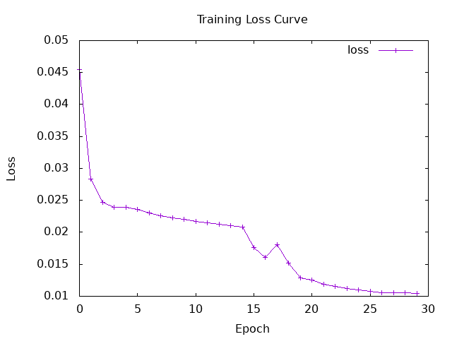
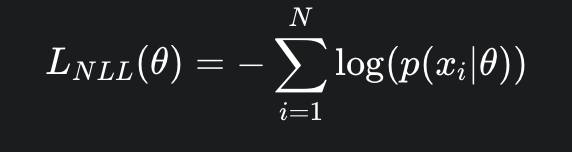
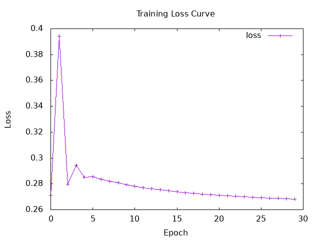
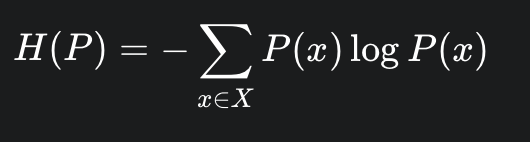
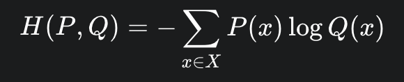
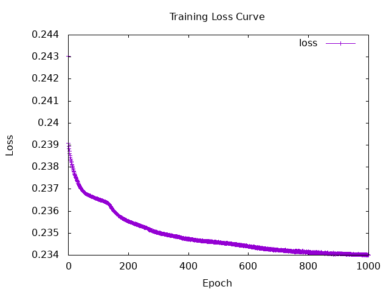

# Evaluation metrics 

```text 

Epoc:    1  --->  Loss: 0.023489
Epoc:    2  --->  Loss: 0.022464
Epoc:    3  --->  Loss: 0.025927
Epoc:    4  --->  Loss: 0.030345
Epoc:    5  --->  Loss: 0.029796
Epoc:    6  --->  Loss: 0.024198
Epoc:    7  --->  Loss: 0.022914
Epoc:    8  --->  Loss: 0.022922
Epoc:    9  --->  Loss: 0.022733
Epoc:   10  --->  Loss: 0.022194
Epoc:   11  --->  Loss: 0.022033
Epoc:   12  --->  Loss: 0.021790
Epoc:   13  --->  Loss: 0.021544
Epoc:   14  --->  Loss: 0.021313
Epoc:   15  --->  Loss: 0.019735
Epoc:   16  --->  Loss: 0.023229
Epoc:   17  --->  Loss: 0.021898
Epoc:   18  --->  Loss: 0.019649
Epoc:   19  --->  Loss: 0.020257
Epoc:   20  --->  Loss: 0.019829
Epoc:   21  --->  Loss: 0.019712
Epoc:   22  --->  Loss: 0.019589
Epoc:   23  --->  Loss: 0.019436
Epoc:   24  --->  Loss: 0.019274
Epoc:   25  --->  Loss: 0.019086
Epoc:   26  --->  Loss: 0.019154
Epoc:   27  --->  Loss: 0.019034
Epoc:   28  --->  Loss: 0.018527
Epoc:   29  --->  Loss: 0.018382
Epoc:   30  --->  Loss: 0.018455

📊 Loss on eval.csv (MSE) : 2.459427e-2

📈 Eval metrics on eval.csv :
Confusion matrix :
Tensor Int64 [2,2] [[ 34,  0],
                    [ 6,  0]]
Accuracy : 0.85
Precision : 0.85
Recall : 1.0
F1 Score (Per Class) - Positive: 0.9189189189189189, Negative: 0.0
Micro-F1 Score : 0.9189189189189189
Macro-F1 Score : 0.45945945945945943
Weighted-F1 Score : 0.7810810810810811

🔎 Predictions on valid.csv :
Predicted (continu): 0.79246664 | Predicted (binary): 1 | Real (continu): 0.75 | Real (binary): 1
Predicted (continu): 0.78491944 | Predicted (binary): 1 | Real (continu): 0.73 | Real (binary): 1
Predicted (continu): 0.75932884 | Predicted (binary): 1 | Real (continu): 0.72 | Real (binary): 1
Predicted (continu): 0.7460907 | Predicted (binary): 1 | Real (continu): 0.62 | Real (binary): 1
Predicted (continu): 0.7593628 | Predicted (binary): 1 | Real (continu): 0.67 | Real (binary): 1
Predicted (continu): 0.80079746 | Predicted (binary): 1 | Real (continu): 0.81 | Real (binary): 1
Predicted (continu): 0.75889957 | Predicted (binary): 1 | Real (continu): 0.63 | Real (binary): 1
Predicted (continu): 0.7567816 | Predicted (binary): 1 | Real (continu): 0.69 | Real (binary): 1
Predicted (continu): 0.8070211 | Predicted (binary): 1 | Real (continu): 0.8 | Real (binary): 1
Predicted (continu): 0.7410568 | Predicted (binary): 1 | Real (continu): 0.43 | Real (binary): 0
```


# Survey about loss functions

## Negative Loss Likelihood

The Negative Loss Likelihood quantifies the difference between the probabilities predicted by a model and the actual 
values observed in a dataset. The idea is to penalize a model based by how unlikely it considers the true data to be.

The formula is 


Where p(x_i|θ) represents the probability/likelihood of observing the data point x_i given the model parameters θ.

If the models assigns a high probability to the true value as the observed value x_i, then p(x_i|θ) is close to 1. The 
log will then be close to 0, and then the NLL will be a small positive number. If the probability of the true value is low, the
log will be a higher negative number, thus the NLL will be a high positive number.

The main use cases for NLL are for classification, for calculating the probability of positive class (in binary 
classification) or the multiple different classes (for multiclass classification). It's also used in generative models, 
which are maximizing the likelihood of the data, which is equivalent of minimizing the NLL.

Here is an attempt of adapting the Admit dataset to NLL :



## Cross-entropy loss

Entropy has been defined by Claude Shannon as : 



This can be understood as the uncertainty of having a specific choice in a distribution of probabilities. For example, 
if we have a probability in a distribution that is close to 1, we are almost sure that we will have this choice in the 
selection, so the uncertainty is low, thus the entropy value is low.

The cross-entropy loss is a metric that measures the distance between two probabilities distribution. In the case of
classification, it's the difference between the true distribution (the true datas) and the predicted datas given by the
model. The formula is : 


where P(x) is the true probability of the event x, and Q(x) the probability of the predicted event x.

A lower cross-entropy value signifies a better model performance, because the predicted values are close to the true 
values. The cross-entropy is also widely used in classification.


## Kullback-Leiber divergence

The Kullback-Leiber divergence quantifies how a probability distribution P (for example in classification, the true 
datas) differs from the probability distribution Q. It measures the amount of information lost when Q is used to 
approximate P. Another way to see the divergence is how many more bits are needed for using a coding scheme optimized 
for the distribution Q. There are multiple applications for this divergence, notably the reinforcement learning in some
gradients methods like Trust Region Policy Optimization or Proximal Policy Optimization, to constrain the change in the 
policy between updates for keeping a stability in the learning process. Another use case is for Variational Autoencoders,
for regularizing the loss functions of VAEs.

# Titanic dataset

I unfortunately didn't have the time to finish Titanic training. I tried to preprocess the datas, and it seems to work, 
but I didn't manage to change the things needed for adapting to the new dataset.

Here is the learning curve I had for reference :

