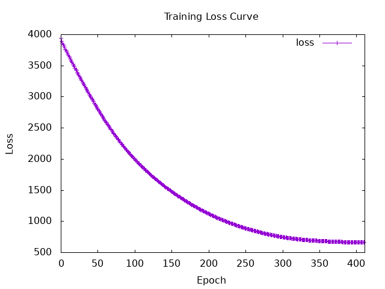
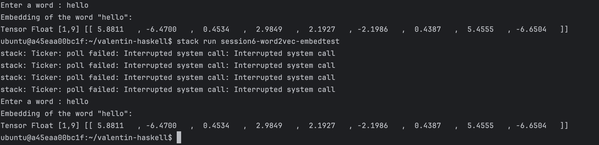

```
text

Epoch: 1, Total Loss: 3944.9246
Epoch: 2, Total Loss: 3889.4138
Epoch: 3, Total Loss: 3862.8062
Epoch: 4, Total Loss: 3836.9814
Epoch: 5, Total Loss: 3811.8718
Epoch: 6, Total Loss: 3787.2654
Epoch: 7, Total Loss: 3763.003
Epoch: 8, Total Loss: 3738.9883
Epoch: 9, Total Loss: 3715.159
Epoch: 10, Total Loss: 3691.4863
Saving model todata/sample_embedding.params
Epoch: 11, Total Loss: 3667.951
Epoch: 12, Total Loss: 3644.5452
Epoch: 13, Total Loss: 3621.2585
Epoch: 14, Total Loss: 3598.0867
Epoch: 15, Total Loss: 3575.0278
Epoch: 16, Total Loss: 3552.0732
Epoch: 17, Total Loss: 3529.223
Epoch: 18, Total Loss: 3506.4673
Epoch: 19, Total Loss: 3483.8037
Epoch: 20, Total Loss: 3461.233
Saving model todata/sample_embedding.params
Epoch: 21, Total Loss: 3438.7449
Epoch: 22, Total Loss: 3416.3376
Epoch: 23, Total Loss: 3394.0173
Epoch: 24, Total Loss: 3371.77
Epoch: 25, Total Loss: 3349.6008
Epoch: 26, Total Loss: 3327.509
Epoch: 27, Total Loss: 3305.4897
Epoch: 28, Total Loss: 3283.542
Epoch: 29, Total Loss: 3261.6638
Epoch: 30, Total Loss: 3239.8623
Saving model todata/sample_embedding.params
Epoch: 31, Total Loss: 3218.1294
Epoch: 32, Total Loss: 3196.4666
Epoch: 33, Total Loss: 3174.8784
Epoch: 34, Total Loss: 3153.3635
Epoch: 35, Total Loss: 3131.9268
Epoch: 36, Total Loss: 3110.5676
Epoch: 37, Total Loss: 3089.2864
Epoch: 38, Total Loss: 3068.091
Epoch: 39, Total Loss: 3046.9824
Epoch: 40, Total Loss: 3025.963
Saving model todata/sample_embedding.params
Epoch: 41, Total Loss: 3005.0364
Epoch: 42, Total Loss: 2984.2048
Epoch: 43, Total Loss: 2963.4727
Epoch: 44, Total Loss: 2942.843
Epoch: 45, Total Loss: 2922.3208
Epoch: 46, Total Loss: 2901.905
Epoch: 47, Total Loss: 2881.6016
Epoch: 48, Total Loss: 2861.4116
Epoch: 49, Total Loss: 2841.3406
Epoch: 50, Total Loss: 2821.3896
Saving model todata/sample_embedding.params
Epoch: 51, Total Loss: 2801.56
Epoch: 52, Total Loss: 2781.8591
Epoch: 53, Total Loss: 2762.2827
Epoch: 54, Total Loss: 2742.8403
Epoch: 55, Total Loss: 2723.5334
Epoch: 56, Total Loss: 2704.361
Epoch: 57, Total Loss: 2685.3318
Epoch: 58, Total Loss: 2666.4412
Epoch: 59, Total Loss: 2647.696
Epoch: 60, Total Loss: 2629.0964
Saving model todata/sample_embedding.params
Epoch: 61, Total Loss: 2610.6426
Epoch: 62, Total Loss: 2592.3386
Epoch: 63, Total Loss: 2574.1853
Epoch: 64, Total Loss: 2556.1821
Epoch: 65, Total Loss: 2538.3328
Epoch: 66, Total Loss: 2520.6355
Epoch: 67, Total Loss: 2503.094
Epoch: 68, Total Loss: 2485.707
Epoch: 69, Total Loss: 2468.4736
Epoch: 70, Total Loss: 2451.3958
Saving model todata/sample_embedding.params
Epoch: 71, Total Loss: 2434.475
Epoch: 72, Total Loss: 2417.7092
Epoch: 73, Total Loss: 2401.0964
Epoch: 74, Total Loss: 2384.6414
Epoch: 75, Total Loss: 2368.3398
Epoch: 76, Total Loss: 2352.1912
Epoch: 77, Total Loss: 2336.1965
Epoch: 78, Total Loss: 2320.3535
Epoch: 79, Total Loss: 2304.6611
Epoch: 80, Total Loss: 2289.119
Saving model todata/sample_embedding.params
Epoch: 81, Total Loss: 2273.7263
Epoch: 82, Total Loss: 2258.4814
Epoch: 83, Total Loss: 2243.3828
Epoch: 84, Total Loss: 2228.4316
Epoch: 85, Total Loss: 2213.62
Epoch: 86, Total Loss: 2198.9531
Epoch: 87, Total Loss: 2184.4255
Epoch: 88, Total Loss: 2170.0405
Epoch: 89, Total Loss: 2155.7905
Epoch: 90, Total Loss: 2141.6782
Saving model todata/sample_embedding.params
Epoch: 91, Total Loss: 2127.6992
Epoch: 92, Total Loss: 2113.854
Epoch: 93, Total Loss: 2100.1396
Epoch: 94, Total Loss: 2086.5564
Epoch: 95, Total Loss: 2073.0986
Epoch: 96, Total Loss: 2059.7688
Epoch: 97, Total Loss: 2046.5626
Epoch: 98, Total Loss: 2033.4801
Epoch: 99, Total Loss: 2020.5183
Epoch: 100, Total Loss: 2007.6746
Saving model todata/sample_embedding.params
Epoch: 101, Total Loss: 1994.9496
Epoch: 102, Total Loss: 1982.3412
Epoch: 103, Total Loss: 1969.8456
Epoch: 104, Total Loss: 1957.4639
Epoch: 105, Total Loss: 1945.1927
Epoch: 106, Total Loss: 1933.0313
Epoch: 107, Total Loss: 1920.9753
Epoch: 108, Total Loss: 1909.0288
Epoch: 109, Total Loss: 1897.1835
Epoch: 110, Total Loss: 1885.4413
Saving model todata/sample_embedding.params
Epoch: 111, Total Loss: 1873.8024
Epoch: 112, Total Loss: 1862.2623
Epoch: 113, Total Loss: 1850.8197
Epoch: 114, Total Loss: 1839.4767
Epoch: 115, Total Loss: 1828.2246
Epoch: 116, Total Loss: 1817.0704
Epoch: 117, Total Loss: 1806.0066
Epoch: 118, Total Loss: 1795.0369
Epoch: 119, Total Loss: 1784.1537
Epoch: 120, Total Loss: 1773.3627
Saving model todata/sample_embedding.params
Epoch: 121, Total Loss: 1762.6555
Epoch: 122, Total Loss: 1752.0381
Epoch: 123, Total Loss: 1741.5024
Epoch: 124, Total Loss: 1731.0532
Epoch: 125, Total Loss: 1720.6846
Epoch: 126, Total Loss: 1710.3993
Epoch: 127, Total Loss: 1700.1924
Epoch: 128, Total Loss: 1690.0667
Epoch: 129, Total Loss: 1680.016
Epoch: 130, Total Loss: 1670.0454
Saving model todata/sample_embedding.params
Epoch: 131, Total Loss: 1660.1498
Epoch: 132, Total Loss: 1650.3295
Epoch: 133, Total Loss: 1640.5813
Epoch: 134, Total Loss: 1630.9093
Epoch: 135, Total Loss: 1621.3076
Epoch: 136, Total Loss: 1611.7787
Epoch: 137, Total Loss: 1602.318
Epoch: 138, Total Loss: 1592.9305
Epoch: 139, Total Loss: 1583.6086
Epoch: 140, Total Loss: 1574.3568
Saving model todata/sample_embedding.params
Epoch: 141, Total Loss: 1565.1715
Epoch: 142, Total Loss: 1556.0542
Epoch: 143, Total Loss: 1547.0022
Epoch: 144, Total Loss: 1538.0164
Epoch: 145, Total Loss: 1529.0952
Epoch: 146, Total Loss: 1520.2375
Epoch: 147, Total Loss: 1511.4451
Epoch: 148, Total Loss: 1502.7136
Epoch: 149, Total Loss: 1494.0458
Epoch: 150, Total Loss: 1485.4396
Saving model todata/sample_embedding.params
Epoch: 151, Total Loss: 1476.8953
Epoch: 152, Total Loss: 1468.4119
Epoch: 153, Total Loss: 1459.9884
Epoch: 154, Total Loss: 1451.6254
Epoch: 155, Total Loss: 1443.3237
Epoch: 156, Total Loss: 1435.0785
Epoch: 157, Total Loss: 1426.8942
Epoch: 158, Total Loss: 1418.7678
Epoch: 159, Total Loss: 1410.6993
Epoch: 160, Total Loss: 1402.6885
Saving model todata/sample_embedding.params
Epoch: 161, Total Loss: 1394.7347
Epoch: 162, Total Loss: 1386.8385
Epoch: 163, Total Loss: 1378.9987
Epoch: 164, Total Loss: 1371.2162
Epoch: 165, Total Loss: 1363.4896
Epoch: 166, Total Loss: 1355.8185
Epoch: 167, Total Loss: 1348.2026
Epoch: 168, Total Loss: 1340.6432
Epoch: 169, Total Loss: 1333.1389
Epoch: 170, Total Loss: 1325.6885
Saving model todata/sample_embedding.params
Epoch: 171, Total Loss: 1318.2942
Epoch: 172, Total Loss: 1310.9524
Epoch: 173, Total Loss: 1303.6661
Epoch: 174, Total Loss: 1296.433
Epoch: 175, Total Loss: 1289.2537
Epoch: 176, Total Loss: 1282.1277
Epoch: 177, Total Loss: 1275.0559
Epoch: 178, Total Loss: 1268.0359
Epoch: 179, Total Loss: 1261.0703
Epoch: 180, Total Loss: 1254.1572
Saving model todata/sample_embedding.params
Epoch: 181, Total Loss: 1247.2969
Epoch: 182, Total Loss: 1240.4877
Epoch: 183, Total Loss: 1233.7327
Epoch: 184, Total Loss: 1227.0302
Epoch: 185, Total Loss: 1220.3787
Epoch: 186, Total Loss: 1213.7793
Epoch: 187, Total Loss: 1207.2324
Epoch: 188, Total Loss: 1200.7375
Epoch: 189, Total Loss: 1194.2931
Epoch: 190, Total Loss: 1187.9006
Saving model todata/sample_embedding.params
Epoch: 191, Total Loss: 1181.5604
Epoch: 192, Total Loss: 1175.2693
Epoch: 193, Total Loss: 1169.0304
Epoch: 194, Total Loss: 1162.8427
Epoch: 195, Total Loss: 1156.7058
Epoch: 196, Total Loss: 1150.6193
Epoch: 197, Total Loss: 1144.5833
Epoch: 198, Total Loss: 1138.5983
Epoch: 199, Total Loss: 1132.6613
Epoch: 200, Total Loss: 1126.7778
Saving model todata/sample_embedding.params
Epoch: 201, Total Loss: 1120.9409
Epoch: 202, Total Loss: 1115.1559
Epoch: 203, Total Loss: 1109.4187
Epoch: 204, Total Loss: 1103.7336
Epoch: 205, Total Loss: 1098.0942
Epoch: 206, Total Loss: 1092.5074
Epoch: 207, Total Loss: 1086.9661
Epoch: 208, Total Loss: 1081.4778
Epoch: 209, Total Loss: 1076.0332
Epoch: 210, Total Loss: 1070.6417
Saving model todata/sample_embedding.params
Epoch: 211, Total Loss: 1065.2942
Epoch: 212, Total Loss: 1059.999
Epoch: 213, Total Loss: 1054.7461
Epoch: 214, Total Loss: 1049.5475
Epoch: 215, Total Loss: 1044.3892
Epoch: 216, Total Loss: 1039.285
Epoch: 217, Total Loss: 1034.2203
Epoch: 218, Total Loss: 1029.2091
Epoch: 219, Total Loss: 1024.2375
Epoch: 220, Total Loss: 1019.31934
Saving model todata/sample_embedding.params
Epoch: 221, Total Loss: 1014.4402
Epoch: 222, Total Loss: 1009.6134
Epoch: 223, Total Loss: 1004.82495
Epoch: 224, Total Loss: 1000.08887
Epoch: 225, Total Loss: 995.38824
Epoch: 226, Total Loss: 990.7402
Epoch: 227, Total Loss: 986.1284
Epoch: 228, Total Loss: 981.5685
Epoch: 229, Total Loss: 977.0441
Epoch: 230, Total Loss: 972.5703
Saving model todata/sample_embedding.params
Epoch: 231, Total Loss: 968.13104
Epoch: 232, Total Loss: 963.7418
Epoch: 233, Total Loss: 959.387
Epoch: 234, Total Loss: 955.08093
Epoch: 235, Total Loss: 950.80835
Epoch: 236, Total Loss: 946.58386
Epoch: 237, Total Loss: 942.393
Epoch: 238, Total Loss: 938.2485
Epoch: 239, Total Loss: 934.1373
Epoch: 240, Total Loss: 930.0724
Saving model todata/sample_embedding.params
Epoch: 241, Total Loss: 926.0395
Epoch: 242, Total Loss: 922.05115
Epoch: 243, Total Loss: 918.0944
Epoch: 244, Total Loss: 914.1823
Epoch: 245, Total Loss: 910.2996
Epoch: 246, Total Loss: 906.4638
Epoch: 247, Total Loss: 902.6521
Epoch: 248, Total Loss: 898.89026
Epoch: 249, Total Loss: 895.1493
Epoch: 250, Total Loss: 891.45984
Saving model todata/sample_embedding.params
Epoch: 251, Total Loss: 887.7876
Epoch: 252, Total Loss: 884.16943
Epoch: 253, Total Loss: 880.56726
Epoch: 254, Total Loss: 877.0171
Epoch: 255, Total Loss: 873.48334
Epoch: 256, Total Loss: 870.0006
Epoch: 257, Total Loss: 866.5354
Epoch: 258, Total Loss: 863.1174
Epoch: 259, Total Loss: 859.722
Epoch: 260, Total Loss: 856.36597
Saving model todata/sample_embedding.params
Epoch: 261, Total Loss: 853.0394
Epoch: 262, Total Loss: 849.7477
Epoch: 263, Total Loss: 846.48834
Epoch: 264, Total Loss: 843.2617
Epoch: 265, Total Loss: 840.0687
Epoch: 266, Total Loss: 836.90796
Epoch: 267, Total Loss: 833.7765
Epoch: 268, Total Loss: 830.682
Epoch: 269, Total Loss: 827.61163
Epoch: 270, Total Loss: 824.5852
Saving model todata/sample_embedding.params
Epoch: 271, Total Loss: 821.5798
Epoch: 272, Total Loss: 818.6183
Epoch: 273, Total Loss: 815.67725
Epoch: 274, Total Loss: 812.78253
Epoch: 275, Total Loss: 809.9058
Epoch: 276, Total Loss: 807.07495
Epoch: 277, Total Loss: 804.264
Epoch: 278, Total Loss: 801.4993
Epoch: 279, Total Loss: 798.75415
Epoch: 280, Total Loss: 796.0578
Saving model todata/sample_embedding.params
Epoch: 281, Total Loss: 793.37897
Epoch: 282, Total Loss: 790.75195
Epoch: 283, Total Loss: 788.13837
Epoch: 284, Total Loss: 785.58154
Epoch: 285, Total Loss: 783.0323
Epoch: 286, Total Loss: 780.55273
Epoch: 287, Total Loss: 778.06793
Epoch: 288, Total Loss: 775.6646
Epoch: 289, Total Loss: 773.2464
Epoch: 290, Total Loss: 770.91614
Saving model todata/sample_embedding.params
Epoch: 291, Total Loss: 768.566
Epoch: 292, Total Loss: 766.3068
Epoch: 293, Total Loss: 764.0283
Epoch: 294, Total Loss: 761.8363
Epoch: 295, Total Loss: 759.63446
Epoch: 296, Total Loss: 757.50934
Epoch: 297, Total Loss: 755.3837
Epoch: 298, Total Loss: 753.32776
Epoch: 299, Total Loss: 751.27704
Epoch: 300, Total Loss: 749.28394
Saving model todata/sample_embedding.params
Epoch: 301, Total Loss: 747.31195
Epoch: 302, Total Loss: 745.3825
Epoch: 303, Total Loss: 743.48773
Epoch: 304, Total Loss: 741.6179
Epoch: 305, Total Loss: 739.7982
Epoch: 306, Total Loss: 737.99426
Epoch: 307, Total Loss: 736.26434
Epoch: 308, Total Loss: 734.51196
Epoch: 309, Total Loss: 732.82007
Epoch: 310, Total Loss: 731.14856
Saving model todata/sample_embedding.params
Epoch: 311, Total Loss: 729.52496
Epoch: 312, Total Loss: 727.926
Epoch: 313, Total Loss: 726.3598
Epoch: 314, Total Loss: 724.8285
Epoch: 315, Total Loss: 723.32007
Epoch: 316, Total Loss: 721.8511
Epoch: 317, Total Loss: 720.4007
Epoch: 318, Total Loss: 718.99316
Epoch: 319, Total Loss: 717.60236
Epoch: 320, Total Loss: 716.25446
Saving model todata/sample_embedding.params
Epoch: 321, Total Loss: 714.92114
Epoch: 322, Total Loss: 713.6268
Epoch: 323, Total Loss: 712.34814
Epoch: 324, Total Loss: 711.10205
Epoch: 325, Total Loss: 709.8783
Epoch: 326, Total Loss: 708.68024
Epoch: 327, Total Loss: 707.5103
Epoch: 328, Total Loss: 706.35956
Epoch: 329, Total Loss: 705.24036
Epoch: 330, Total Loss: 704.1344
Saving model todata/sample_embedding.params
Epoch: 331, Total Loss: 703.061
Epoch: 332, Total Loss: 702.00525
Epoch: 333, Total Loss: 700.96985
Epoch: 334, Total Loss: 699.96735
Epoch: 335, Total Loss: 698.9693
Epoch: 336, Total Loss: 698.0133
Epoch: 337, Total Loss: 697.05005
Epoch: 338, Total Loss: 696.13745
Epoch: 339, Total Loss: 695.2074
Epoch: 340, Total Loss: 694.33167
Saving model todata/sample_embedding.params
Epoch: 341, Total Loss: 693.434
Epoch: 342, Total Loss: 692.60126
Epoch: 343, Total Loss: 691.7372
Epoch: 344, Total Loss: 690.9442
Epoch: 345, Total Loss: 690.1116
Epoch: 346, Total Loss: 689.35406
Epoch: 347, Total Loss: 688.5505
Epoch: 348, Total Loss: 687.82324
Epoch: 349, Total Loss: 687.0498
Epoch: 350, Total Loss: 686.3512
Saving model todata/sample_embedding.params
Epoch: 351, Total Loss: 685.6071
Epoch: 352, Total Loss: 684.9381
Epoch: 353, Total Loss: 684.22046
Epoch: 354, Total Loss: 683.5807
Epoch: 355, Total Loss: 682.8883
Epoch: 356, Total Loss: 682.2757
Epoch: 357, Total Loss: 681.607
Epoch: 358, Total Loss: 681.0188
Epoch: 359, Total Loss: 680.3751
Epoch: 360, Total Loss: 679.80963
Saving model todata/sample_embedding.params
Epoch: 361, Total Loss: 679.18976
Epoch: 362, Total Loss: 678.6454
Epoch: 363, Total Loss: 678.0481
Epoch: 364, Total Loss: 677.526
Epoch: 365, Total Loss: 676.9468
Epoch: 366, Total Loss: 676.4464
Epoch: 367, Total Loss: 675.8869
Epoch: 368, Total Loss: 675.4079
Epoch: 369, Total Loss: 674.86505
Epoch: 370, Total Loss: 674.4027
Saving model todata/sample_embedding.params
Epoch: 371, Total Loss: 673.88245
Epoch: 372, Total Loss: 673.4371
Epoch: 373, Total Loss: 672.93
Epoch: 374, Total Loss: 672.4978
Epoch: 375, Total Loss: 672.01
Epoch: 376, Total Loss: 671.59454
Epoch: 377, Total Loss: 671.1232
Epoch: 378, Total Loss: 670.72217
Epoch: 379, Total Loss: 670.2682
Epoch: 380, Total Loss: 669.8806
Saving model todata/sample_embedding.params
Epoch: 381, Total Loss: 669.4442
Epoch: 382, Total Loss: 669.0744
Epoch: 383, Total Loss: 668.6455
Epoch: 384, Total Loss: 668.2816
Epoch: 385, Total Loss: 667.87695
Epoch: 386, Total Loss: 667.52234
Epoch: 387, Total Loss: 667.1225
Epoch: 388, Total Loss: 666.78326
Epoch: 389, Total Loss: 666.39716
Epoch: 390, Total Loss: 666.0691
Saving model todata/sample_embedding.params
Epoch: 391, Total Loss: 665.6944
Epoch: 392, Total Loss: 665.3774
Epoch: 393, Total Loss: 665.01416
Epoch: 394, Total Loss: 664.70764
Epoch: 395, Total Loss: 664.35614
Epoch: 396, Total Loss: 664.06085
Epoch: 397, Total Loss: 663.71796
Epoch: 398, Total Loss: 663.4313
Epoch: 399, Total Loss: 663.09796
Epoch: 400, Total Loss: 662.82306
Saving model todata/sample_embedding.params
Epoch: 401, Total Loss: 662.4969
Epoch: 402, Total Loss: 662.2306
Epoch: 403, Total Loss: 661.9176
Epoch: 404, Total Loss: 661.66235
Epoch: 405, Total Loss: 661.34937
Epoch: 406, Total Loss: 661.1006
Epoch: 407, Total Loss: 660.8017
Epoch: 408, Total Loss: 660.56885
Epoch: 409, Total Loss: 660.27106
Epoch: 410, Total Loss: 660.0439
Saving model todata/sample_embedding.params
Epoch: 411, Total Loss: 659.7546
Epoch: 412, Total Loss: 659.5378
Epoch: 413, Total Loss: 659.2462
Epoch: 414, Total Loss: 659.0356
Epoch: 415, Total Loss: 658.75464
Epoch: 416, Total Loss: 658.5567
Epoch: 417, Total Loss: 658.28186
Epoch: 418, Total Loss: 658.0888
^C
```

Goal for this week 
- [x] Creating and training word2vec from scratch
I did my best, but I mainly only did the word2vec and training (I only finished it on 23/05/2025). It was still 
interesting

- [x] Make sure you can take a corresponding embedding from a saved embedding by a word

- [] Evaluate the trained data with STS
I wish I could test the trained data so I can verify that my model works :(. I will try to continue if I have time.
